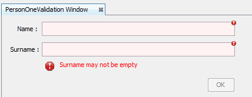

<h2>Examples of Simple Validation API in Netbeans Platform with comments.<h2>
<h3>1.Simple form with one validation panel</h3>
Java file : <a href="https://github.com/piotrpaw/NetbeansValidation/blob/master/ValidationExamples/src/main/java/com/pwl/validationexamples/PersonOneValidationTopComponent.java">PersonOneValidationTopComponent</a> 

<h3>2.Custom Validator</h3>
<h5>2.1
